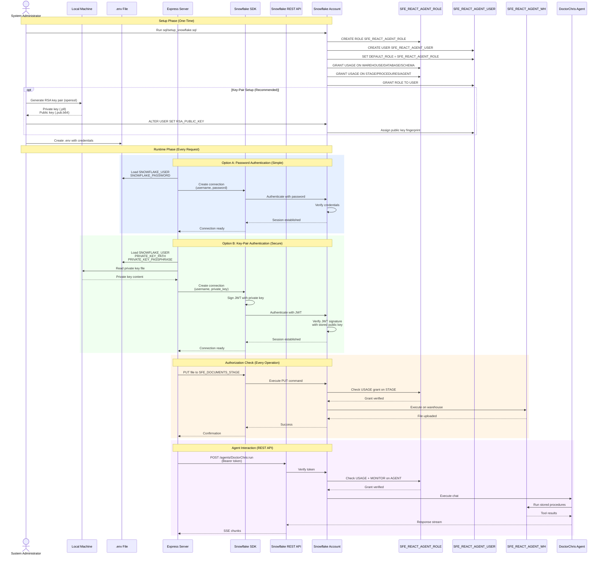

# Auth Flow - React Agent API Upload

**Author:** SE Community  
**Last Updated:** 2025-11-25  
**Expires:** 2025-12-25  
**Status:** Reference Implementation

---


**Reference Implementation:** This code demonstrates production-grade architectural patterns and best practices. Review and customize security, networking, and business logic for your organization's specific requirements before deployment.

---

## Overview

This diagram shows the authentication and authorization flow for the application, including both password-based and RSA key-pair authentication methods, along with role-based access control in Snowflake.

---

## Diagram



---

## Component Descriptions

### System Administrator
- **Purpose:** Sets up Snowflake objects and manages credentials
- **Technology:** Human operator with ACCOUNTADMIN/SYSADMIN access
- **Location:** Local development machine
- **Dependencies:** Access to Snowflake account, SQL client

### Local Machine
- **Purpose:** Stores private keys and runs Express server
- **Technology:** macOS/Linux/Windows workstation
- **Location:** Developer's computer
- **Dependencies:** OpenSSL for key generation
- **Security:** Private keys in `.secrets/keys/` (excluded via `.git/info/exclude`)

### .env File
- **Purpose:** Stores credentials and configuration
- **Technology:** Environment variable file
- **Location:** `.secrets/.env` (excluded via `.git/info/exclude`)
- **Dependencies:** None
- **Security:** NEVER committed to git, local-only

### Express Server
- **Purpose:** Backend application making Snowflake calls
- **Technology:** Node.js, Express
- **Location:** `server/src/`
- **Dependencies:** Snowflake credentials, network access
- **Authentication:** Inherits from .env configuration
- **Port:** 4000

### Snowflake SDK
- **Purpose:** Node.js client for Snowflake connections
- **Technology:** snowflake-sdk npm package
- **Location:** `server/src/snowflakeClient.js`
- **Dependencies:** Credentials (password or private key)
- **Authentication Methods:**
  - Username/password (simple)
  - Username/private key (secure)

### Snowflake REST API
- **Purpose:** REST endpoint for Cortex Agent communication
- **Technology:** Snowflake-hosted REST API
- **Location:** `https://{account}.snowflakecomputing.com`
- **Dependencies:** Bearer token (JWT or PAT)
- **Authentication:** JWT (key-pair) or PAT

### SFE_REACT_AGENT_ROLE
- **Purpose:** Service role with minimal required permissions
- **Technology:** Snowflake RBAC role
- **Location:** Account-level role
- **Dependencies:** Created by setup SQL script
- **Grants:**
  - USAGE on SFE_REACT_AGENT_WH
  - USAGE on SNOWFLAKE_EXAMPLE database
  - USAGE on REACT_AGENT_STAGE schema
  - USAGE on SFE_DOCUMENTS_STAGE
  - USAGE on stored procedures
  - USAGE + MONITOR on DoctorChris agent

### SFE_REACT_AGENT_USER
- **Purpose:** Service user for application authentication
- **Technology:** Snowflake user account
- **Location:** Account-level user
- **Dependencies:** SFE_REACT_AGENT_ROLE granted
- **Properties:**
  - DEFAULT_ROLE: SFE_REACT_AGENT_ROLE
  - DEFAULT_WAREHOUSE: SFE_REACT_AGENT_WH
  - Optional: RSA_PUBLIC_KEY assigned

### DoctorChris Agent
- **Purpose:** Cortex Agent for document Q&A
- **Technology:** Snowflake Cortex Agent
- **Location:** SNOWFLAKE_EXAMPLE.REACT_AGENT_STAGE.DoctorChris
- **Dependencies:** Warehouse, stored procedures, Cortex services
- **Access Control:** Requires USAGE + MONITOR grants

---

## Authentication Methods

### Method 1: Username/Password (Development)

**Pros:**
- Simple to set up
- No key management required
- Works immediately

**Cons:**
- Less secure (password in .env)
- Password rotation required
- Not recommended for production

**Configuration (.env):**
```bash
SNOWFLAKE_AUTH_TYPE=password
SNOWFLAKE_USER=your_username
SNOWFLAKE_PASSWORD=your_password
SNOWFLAKE_ROLE=SFE_REACT_AGENT_ROLE
```

### Method 2: RSA Key-Pair (Production)

**Pros:**
- More secure (no password)
- JWT tokens have expiration
- Industry best practice
- Supports service accounts

**Cons:**
- More complex setup
- Key management required
- Requires OpenSSL

**Configuration (.secrets/.env):**
```bash
SNOWFLAKE_AUTH_TYPE=keypair
SNOWFLAKE_USER=SFE_REACT_AGENT_USER
SNOWFLAKE_PRIVATE_KEY_PATH=.secrets/keys/rsa_key.p8
SNOWFLAKE_ROLE=SFE_REACT_AGENT_ROLE
```

**Setup Steps:**
1. Generate RSA key pair (2048-bit)
2. Export public key as Base64
3. Assign public key to Snowflake user
4. Store private key in `.secrets/keys/` (excluded via `.git/info/exclude`)

**See:** `docs/01-KEYPAIR-AUTH.md` for detailed instructions

---

## Role-Based Access Control (RBAC)

### Grant Hierarchy

```
ACCOUNTADMIN (setup only)
  └─> SYSADMIN (creates objects)
       ├─> Creates: SFE_REACT_AGENT_WH
       ├─> Creates: SNOWFLAKE_EXAMPLE database
       ├─> Creates: REACT_AGENT_STAGE schema
       ├─> Creates: SFE_DOCUMENTS_STAGE
       ├─> Creates: Stored procedures
       └─> Creates: DoctorChris agent

ACCOUNTADMIN (manages users/roles)
  ├─> Creates: SFE_REACT_AGENT_ROLE
  ├─> Creates: SFE_REACT_AGENT_USER
  └─> Grants: ROLE to USER

SFE_REACT_AGENT_ROLE (application role)
  ├─> USAGE on warehouse
  ├─> USAGE on database
  ├─> USAGE on schema
  ├─> USAGE on stage
  ├─> USAGE on procedures
  └─> USAGE + MONITOR on agent
```

### Permission Matrix

| Object Type | Object Name | Grant Type | Purpose |
|-------------|-------------|------------|---------|
| Warehouse | SFE_REACT_AGENT_WH | USAGE | Execute queries |
| Database | SNOWFLAKE_EXAMPLE | USAGE | Access database |
| Schema | REACT_AGENT_STAGE | USAGE | Access schema |
| Stage | SFE_DOCUMENTS_STAGE | USAGE | Upload/read files |
| Procedure | ANSWER_DOCUMENT_QUESTION | USAGE | Execute tool |
| Procedure | TRANSLATE_DOCUMENT | USAGE | Execute tool |
| Agent | DoctorChris | USAGE | Chat with agent |
| Agent | DoctorChris | MONITOR | View agent status |

---

## Security Best Practices

### Credential Management
- Store credentials in `.secrets/.env` (excluded via `.git/info/exclude`)
- Use key-pair auth for production
- Rotate keys/passwords regularly
- Never commit secrets to git
- Never hardcode credentials in code

### Least Privilege
- Service role has minimal grants
- User locked to single role
- No direct table access (only via tools)

### Network Security
- All connections use HTTPS/TLS
- Snowflake enforces TLS 1.2+
- Optional: Snowflake Network Policy (IP whitelist)

### Audit Trail
- All operations logged in QUERY_HISTORY
- User activity tracked by account
- Agent conversations logged
- Use ACCOUNTADMIN to review logs

---

## Token Flow (Key-Pair)

### JWT Generation

```
1. Load private key from .secrets/keys/
2. Create JWT payload:
   {
     "iss": "account_identifier",
     "sub": "SFE_REACT_AGENT_USER",
     "iat": current_timestamp,
     "exp": current_timestamp + 300 (5 min)
   }
3. Sign JWT with private key (RS256)
4. Send as Authorization: Bearer <JWT>
```

### JWT Validation (Snowflake Side)

```
1. Receive JWT from client
2. Decode header and payload
3. Look up user's public key
4. Verify signature with public key
5. Check expiration (exp claim)
6. Check issuer (iss claim)
7. If valid, establish session
```

---

## Troubleshooting

### Common Issues

| Issue | Cause | Solution |
|-------|-------|----------|
| "Invalid username or password" | Wrong credentials in .env | Verify SNOWFLAKE_USER and SNOWFLAKE_PASSWORD |
| "JWT token invalid" | Public key not assigned | Run `ALTER USER SET RSA_PUBLIC_KEY` |
| "Insufficient privileges" | Missing grants | Verify role grants in setup SQL |
| "Warehouse not found" | Wrong warehouse name | Check SNOWFLAKE_WAREHOUSE in .env |
| "Agent not found" | Wrong schema/name | Verify agent fully qualified name |

---

## Change History

See `.cursor/DIAGRAM_CHANGELOG.md` for version history.
