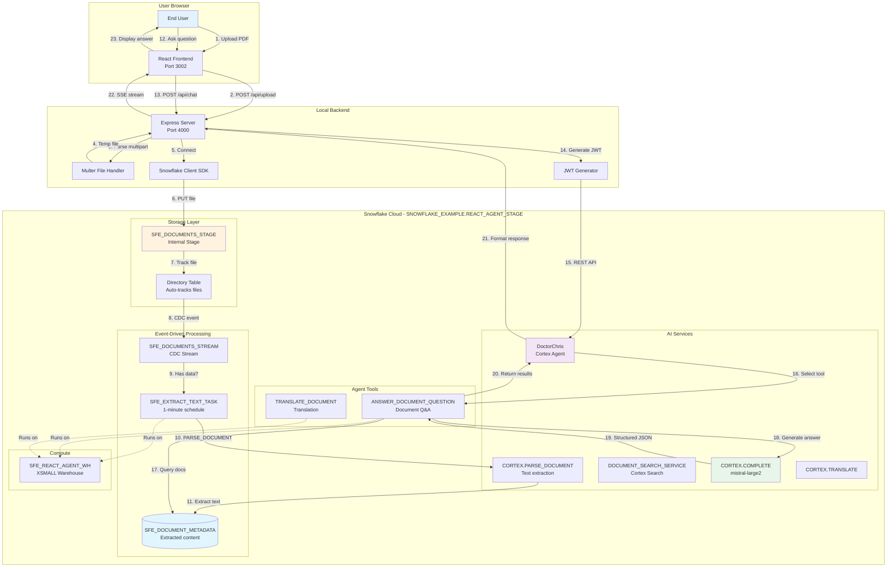

# Data Flow - React Agent API Upload

**Author:** SE Community  
**Last Updated:** 2025-11-25  
**Expires:** 2025-12-25  
**Status:** Reference Implementation

---

**Reference Implementation:** This code demonstrates production-grade architectural patterns and best practices. Review and customize security, networking, and business logic for your organization's specific requirements before deployment.

---

## Overview

This diagram shows how document data flows through the React Cortex Agent chat application, from user upload through Snowflake storage to AI-powered analysis and response generation using native Snowflake document intelligence.

---

## Diagram

---

## Component Descriptions

### User Browser
- **Purpose:** Client-side interface for document upload and AI chat
- **Technology:** React 18, CSS Modules, Fetch API
- **Location:** `src/App.js`, `src/components/`
- **Dependencies:** Express backend API

### Express Server
- **Purpose:** Backend API server handling uploads and agent communication
- **Technology:** Node.js, Express.js, multer, snowflake-sdk
- **Location:** `server/src/app.js`, `server/src/routes/`
- **Dependencies:** Snowflake account, environment variables (.secrets/.env)
- **Port:** 4000

### Multer File Handler
- **Purpose:** Parses multipart/form-data for PDF uploads
- **Technology:** multer npm package
- **Location:** `server/src/routes/upload.js`
- **Dependencies:** Express middleware

### Snowflake Client SDK
- **Purpose:** Connects to Snowflake and executes file operations
- **Technology:** snowflake-sdk npm package
- **Location:** `server/src/snowflakeClient.js`
- **Dependencies:** Snowflake credentials, network access

### SFE_DOCUMENTS_STAGE (Internal Stage)
- **Purpose:** Storage for uploaded PDF documents with directory table
- **Technology:** Snowflake Internal Stage with DIRECTORY enabled
- **Location:** `SNOWFLAKE_EXAMPLE.REACT_AGENT_STAGE.SFE_DOCUMENTS_STAGE`
- **Dependencies:** SFE_REACT_AGENT_WH warehouse

### SFE_DOCUMENTS_STREAM
- **Purpose:** CDC stream tracking new file uploads
- **Technology:** Snowflake Stream on Stage
- **Location:** `SNOWFLAKE_EXAMPLE.REACT_AGENT_STAGE.SFE_DOCUMENTS_STREAM`
- **Dependencies:** Directory table on stage

### SFE_EXTRACT_TEXT_TASK
- **Purpose:** Event-driven task that processes new documents every minute
- **Technology:** Snowflake Serverless Task
- **Location:** `SNOWFLAKE_EXAMPLE.REACT_AGENT_STAGE.SFE_EXTRACT_TEXT_TASK`
- **Dependencies:** Stream, warehouse, PARSE_DOCUMENT function

### SFE_DOCUMENT_METADATA
- **Purpose:** Stores extracted text and metadata for all processed documents
- **Technology:** Snowflake Table
- **Location:** `SNOWFLAKE_EXAMPLE.REACT_AGENT_STAGE.SFE_DOCUMENT_METADATA`
- **Dependencies:** Task populates via MERGE

### DoctorChris Cortex Agent
- **Purpose:** Orchestrates AI-powered document Q&A and translation
- **Technology:** Snowflake Cortex Agent with custom tools
- **Location:** `SNOWFLAKE_EXAMPLE.REACT_AGENT_STAGE.DoctorChris`
- **Dependencies:** claude-4-sonnet orchestration model, stored procedures, warehouse

### ANSWER_DOCUMENT_QUESTION
- **Purpose:** Agent tool that queries documents and generates structured answers
- **Technology:** SQL Stored Procedure using CORTEX.COMPLETE
- **Location:** `sql/setup_snowflake.sql`
- **Dependencies:** SFE_DOCUMENT_METADATA table, mistral-large2 model

### TRANSLATE_DOCUMENT
- **Purpose:** Agent tool that translates document content
- **Technology:** SQL Stored Procedure using CORTEX.TRANSLATE
- **Location:** `sql/setup_snowflake.sql`
- **Dependencies:** SFE_DOCUMENT_METADATA table

### SFE_REACT_AGENT_WH
- **Purpose:** Dedicated compute warehouse for all agent operations
- **Technology:** Snowflake Virtual Warehouse (XSMALL, AUTO_SUSPEND=60s)
- **Location:** Account-level warehouse
- **Dependencies:** Warehouse grants to SFE_REACT_AGENT_ROLE

---

## Data Transformations

| Stage | Input Format | Transformation | Output Format |
|-------|--------------|----------------|---------------|
| Upload | PDF (binary) | multipart/form-data parsing | Temp file |
| Stage | Temp file | PUT to internal stage | Staged file |
| Directory | Staged file | Auto-track in directory table | File metadata |
| Stream | Directory change | CDC capture | Change record |
| Task | Change record | CORTEX.PARSE_DOCUMENT | Extracted text |
| Metadata | Extracted text | MERGE into table | Searchable document |
| Q&A | User question + docs | CORTEX.COMPLETE | Structured JSON |
| Response | Tool output JSON | Agent formatting | User-friendly text |

---

## Change History

See `.cursor/DIAGRAM_CHANGELOG.md` for version history.
