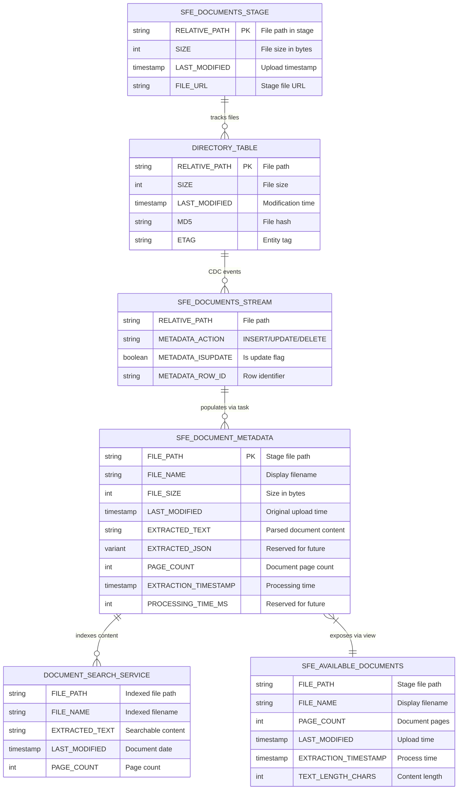
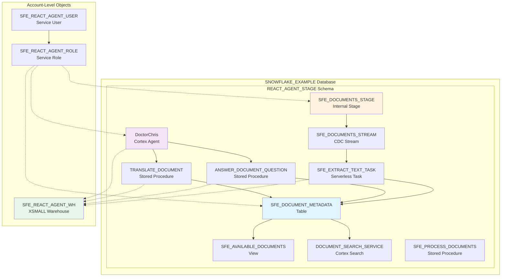

# Data Model - React Agent API Upload

**Author:** SE Community  
**Last Updated:** 2025-11-25  
**Expires:** 2025-12-25  
**Status:** Reference Implementation

---


**Reference Implementation:** This code demonstrates production-grade architectural patterns and best practices. Review and customize security, networking, and business logic for your organization's specific requirements before deployment.

---

## Overview

This diagram shows the database schema and relationships for the React Cortex Agent document intelligence application, including tables, stages, streams, and their relationships within the `SNOWFLAKE_EXAMPLE` database.

---

## Entity Relationship Diagram



---

## Schema Architecture



---

## Component Descriptions

### SFE_DOCUMENTS_STAGE (Internal Stage)
- **Purpose:** Primary storage for uploaded PDF documents
- **Technology:** Snowflake Internal Stage with SSE encryption
- **Location:** `SNOWFLAKE_EXAMPLE.REACT_AGENT_STAGE.SFE_DOCUMENTS_STAGE`
- **Features:**
  - Directory table enabled for file tracking
  - Server-side encryption (required for PARSE_DOCUMENT)
  - Supports PUT/GET operations via SDK

### Directory Table (Virtual)
- **Purpose:** Automatic tracking of files in stage
- **Technology:** Snowflake Directory Table (built-in)
- **Location:** `DIRECTORY(@SFE_DOCUMENTS_STAGE)`
- **Features:**
  - Auto-updated on file changes
  - Provides file metadata (size, modified date, hash)
  - Enables stream-based CDC

### SFE_DOCUMENTS_STREAM
- **Purpose:** Captures file upload events for processing
- **Technology:** Snowflake Stream on Stage
- **Location:** `SNOWFLAKE_EXAMPLE.REACT_AGENT_STAGE.SFE_DOCUMENTS_STREAM`
- **Features:**
  - Tracks INSERT/UPDATE/DELETE on directory
  - Enables event-driven architecture
  - Auto-advances offset on consumption

### SFE_DOCUMENT_METADATA
- **Purpose:** Stores extracted text and metadata for all documents
- **Technology:** Snowflake Table
- **Location:** `SNOWFLAKE_EXAMPLE.REACT_AGENT_STAGE.SFE_DOCUMENT_METADATA`
- **Columns:**
  - `FILE_PATH` (PK): Unique path in stage
  - `EXTRACTED_TEXT`: Full document text via PARSE_DOCUMENT
  - `PAGE_COUNT`: Document page count
  - `EXTRACTION_TIMESTAMP`: When processing completed

### SFE_AVAILABLE_DOCUMENTS (View)
- **Purpose:** Simplified view for agent tools and UI
- **Technology:** Snowflake View
- **Location:** `SNOWFLAKE_EXAMPLE.REACT_AGENT_STAGE.SFE_AVAILABLE_DOCUMENTS`
- **Features:**
  - Excludes internal columns
  - Adds calculated text_length_chars
  - Ordered by LAST_MODIFIED DESC

### DOCUMENT_SEARCH_SERVICE
- **Purpose:** Semantic search across all document content
- **Technology:** Snowflake Cortex Search Service
- **Location:** `SNOWFLAKE_EXAMPLE.REACT_AGENT_STAGE.DOCUMENT_SEARCH_SERVICE`
- **Features:**
  - Hybrid vector + keyword search
  - 1-minute target lag
  - Indexes EXTRACTED_TEXT column

### SFE_EXTRACT_TEXT_TASK
- **Purpose:** Event-driven document processing
- **Technology:** Snowflake Serverless Task
- **Location:** `SNOWFLAKE_EXAMPLE.REACT_AGENT_STAGE.SFE_EXTRACT_TEXT_TASK`
- **Schedule:** Every 1 minute
- **Condition:** `SYSTEM$STREAM_HAS_DATA('SFE_DOCUMENTS_STREAM')`
- **Action:** Calls SFE_PROCESS_DOCUMENTS procedure

### DoctorChris (Cortex Agent)
- **Purpose:** AI-powered document Q&A and translation
- **Technology:** Snowflake Cortex Agent
- **Location:** `SNOWFLAKE_EXAMPLE.REACT_AGENT_STAGE.DoctorChris`
- **Orchestration Model:** claude-4-sonnet
- **Tools:**
  - `document_qa_tool` -> ANSWER_DOCUMENT_QUESTION
  - `document_translation_tool` -> TRANSLATE_DOCUMENT

### SFE_REACT_AGENT_WH (Warehouse)
- **Purpose:** Dedicated compute for all operations
- **Technology:** Snowflake Virtual Warehouse
- **Size:** XSMALL
- **Features:**
  - AUTO_SUSPEND: 60 seconds
  - AUTO_RESUME: TRUE
  - INITIALLY_SUSPENDED: TRUE

### SFE_REACT_AGENT_ROLE (Role)
- **Purpose:** Service role with minimal privileges
- **Technology:** Snowflake RBAC Role
- **Grants:**
  - USAGE on warehouse, database, schema
  - READ/WRITE on stage
  - SELECT on tables/views
  - USAGE on procedures and agent

### SFE_REACT_AGENT_USER (User)
- **Purpose:** Service account for application authentication
- **Technology:** Snowflake User
- **Features:**
  - DEFAULT_ROLE: SFE_REACT_AGENT_ROLE
  - DEFAULT_WAREHOUSE: SFE_REACT_AGENT_WH
  - Supports RSA key-pair authentication

---

## Data Dictionary

### SFE_DOCUMENT_METADATA Table

| Column | Type | Nullable | Default | Description |
|--------|------|----------|---------|-------------|
| FILE_PATH | STRING | NO | - | Primary key, stage file path |
| FILE_NAME | STRING | YES | - | Display name extracted from path |
| FILE_SIZE | INTEGER | YES | - | File size in bytes |
| LAST_MODIFIED | TIMESTAMP_NTZ | YES | - | Original upload timestamp |
| EXTRACTED_TEXT | STRING | YES | - | Full text from PARSE_DOCUMENT |
| EXTRACTED_JSON | VARIANT | YES | - | Reserved for structured extraction |
| PAGE_COUNT | INTEGER | YES | - | Document page count |
| EXTRACTION_TIMESTAMP | TIMESTAMP_NTZ | YES | CURRENT_TIMESTAMP() | When extraction completed |
| PROCESSING_TIME_MS | INTEGER | YES | - | Reserved for performance tracking |

---

## Object Dependencies

```
SFE_DOCUMENTS_STAGE
  └── SFE_DOCUMENTS_STREAM (depends on)
       └── SFE_EXTRACT_TEXT_TASK (reads from)
            └── SFE_PROCESS_DOCUMENTS (calls)
                 └── SFE_DOCUMENT_METADATA (writes to)
                      ├── SFE_AVAILABLE_DOCUMENTS (reads from)
                      ├── DOCUMENT_SEARCH_SERVICE (indexes)
                      ├── ANSWER_DOCUMENT_QUESTION (queries)
                      └── TRANSLATE_DOCUMENT (queries)
                           └── DoctorChris (uses as tools)
```

---

## Change History

See `.cursor/DIAGRAM_CHANGELOG.md` for version history.

