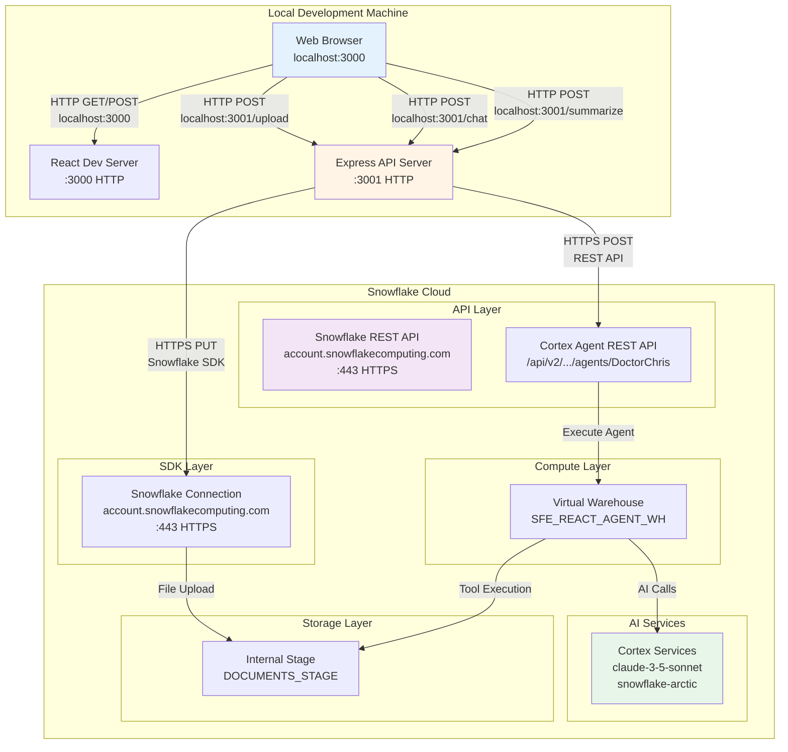

# Network Flow - React Agent API Upload

**Author:** Michael Whitaker  
**Last Updated:** 2025-11-12  
**Status:** ⚠️ **DEMO/NON-PRODUCTION**

---

⚠️ **WARNING: This is a demonstration project. NOT FOR PRODUCTION USE.**

---

## Overview

This diagram shows the network architecture and connectivity between the React frontend, Express backend, and Snowflake cloud services, including all ports, protocols, and API endpoints.

---

## Diagram

---

## Component Descriptions

### Web Browser
- **Purpose:** User interface client
- **Technology:** Modern browser (Chrome, Firefox, Safari, Edge)
- **Location:** User's local machine
- **Dependencies:** Internet connection for localhost access
- **Ports:** Connects to :3000 (React) and :3001 (Express)

### React Dev Server
- **Purpose:** Development server for React frontend
- **Technology:** create-react-app dev server (webpack-dev-server)
- **Location:** `npm start` in project root
- **Dependencies:** Node.js 18+, npm
- **Port:** 3000 (HTTP)
- **Endpoints:** 
  - `GET /` - Main application
  - Static assets from `public/` and `src/`

### Express API Server
- **Purpose:** Backend API for file uploads and Snowflake communication
- **Technology:** Express.js, Node.js
- **Location:** `server/src/index.js`
- **Dependencies:** Node.js 18+, npm packages
- **Port:** 3001 (HTTP)
- **Endpoints:**
  - `POST /upload` - File upload handler
  - `POST /chat` - Agent chat interface (SSE)
  - `POST /summarize` - Document summarization
  - `GET /config` - Frontend configuration

### Snowflake REST API
- **Purpose:** REST API endpoint for Cortex Agent communication
- **Technology:** Snowflake-hosted REST API
- **Location:** `https://{account}.snowflakecomputing.com`
- **Dependencies:** Valid authentication (JWT or PAT)
- **Port:** 443 (HTTPS)
- **Authentication:** Bearer token (JWT or PAT)
- **Key Endpoints:**
  - `POST /api/v2/databases/SNOWFLAKE_EXAMPLE/schemas/REACT_AGENT_STAGE/agents/DoctorChris:chat`
  - `GET /api/v2/databases/SNOWFLAKE_EXAMPLE/schemas/REACT_AGENT_STAGE/agents/DoctorChris:`

### Cortex Agent REST API
- **Purpose:** Specific endpoint for DoctorChris agent interactions
- **Technology:** Snowflake Cortex Agent service
- **Location:** REST API path under Snowflake account
- **Dependencies:** Agent definition, warehouse grants
- **Port:** 443 (HTTPS via parent API)
- **Format:** JSON request/response with streaming support

### Snowflake SDK Connection
- **Purpose:** Node.js SDK connection for file operations
- **Technology:** snowflake-sdk npm package
- **Location:** `server/src/snowflakeClient.js`
- **Dependencies:** Snowflake credentials in .env
- **Port:** 443 (HTTPS)
- **Authentication:** Username/password or key-pair
- **Operations:**
  - PUT files to internal stage
  - Execute SQL statements
  - Query metadata

### Virtual Warehouse
- **Purpose:** Compute engine for agent tool execution
- **Technology:** Snowflake Virtual Warehouse (XSMALL)
- **Location:** `SFE_REACT_AGENT_WH` (account-level)
- **Dependencies:** Auto-resume enabled
- **Network:** Internal Snowflake network
- **Cost:** Per-second billing

### Internal Stage
- **Purpose:** Storage for uploaded documents
- **Technology:** Snowflake Internal Stage
- **Location:** `SNOWFLAKE_EXAMPLE.REACT_AGENT_STAGE.DOCUMENTS_STAGE`
- **Dependencies:** Warehouse for PUT operations
- **Network:** Internal Snowflake storage network
- **Access:** Via Snowflake SDK PUT command

### Cortex Services
- **Purpose:** AI/ML service layer (LLMs, translation, etc.)
- **Technology:** Snowflake Cortex
- **Location:** Snowflake-managed service
- **Dependencies:** Cortex service availability
- **Network:** Internal Snowflake service network
- **Models:** claude-3-5-sonnet, snowflake-arctic

---

## Network Security

### TLS/HTTPS
- All external connections use HTTPS (port 443)
- Snowflake enforces TLS 1.2+
- Certificate validation required

### Authentication Methods
1. **Username/Password:** Basic auth for development
2. **Key-Pair (JWT):** RSA key-pair authentication (recommended)
3. **PAT:** Programmatic Access Token for REST API

### Firewall Requirements
- **Outbound:** Express server needs HTTPS (443) access to Snowflake
- **Inbound:** None (development runs on localhost)
- **Snowflake Network Policy:** Optional, can restrict by IP

### Environment Isolation
- **Development:** localhost only (no external exposure)
- **Production:** Would require reverse proxy, load balancer, TLS termination

---

## Port Reference

| Service | Port | Protocol | Direction | Purpose |
|---------|------|----------|-----------|---------|
| React Dev Server | 3000 | HTTP | Inbound (localhost) | Frontend UI |
| Express API | 3001 | HTTP | Inbound (localhost) | Backend API |
| Snowflake | 443 | HTTPS | Outbound | API & SDK connections |

---

## API Endpoints

### Express Backend (localhost:3001)

| Method | Path | Purpose | Request | Response |
|--------|------|---------|---------|----------|
| POST | `/upload` | Upload PDF to stage | multipart/form-data | {success, filename} |
| POST | `/chat` | Send message to agent | {message, filename} | SSE stream |
| POST | `/summarize` | Summarize document | {filename} | {summary} |
| GET | `/config` | Get agent config | - | {agentName, schema, ...} |

### Snowflake REST API

| Method | Path | Purpose | Auth | Response |
|--------|------|---------|------|----------|
| POST | `/api/v2/.../agents/DoctorChris:chat` | Chat with agent | Bearer JWT/PAT | JSON message stream |
| GET | `/api/v2/.../agents/DoctorChris:` | Get agent spec | Bearer JWT/PAT | Agent definition YAML |

---

## Change History

See `.cursornotes/DIAGRAM_CHANGELOG.md` for version history.
