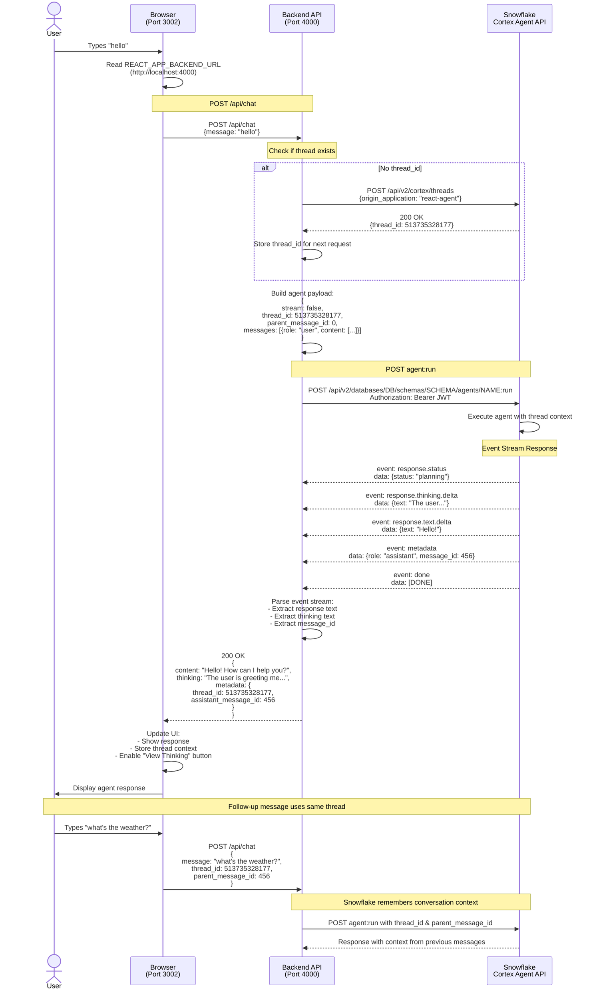

# Request Flow Diagram - Cortex Agent Chat

**Author:** Michael Whitaker  
**Last Updated:** 2024-11-13  
**Status:** Active

## Overview

This diagram shows the complete request/response flow when a user sends a message to the Cortex Agent, including thread management and event stream parsing.

## Sequence Diagram



## Data Flow by Component

### Frontend (React - Port 3002)
**Environment Variables:**
- `REACT_APP_BACKEND_URL`: Where to find backend (default: `http://localhost:4000`)

**State Management:**
- `threadId`: Current conversation thread ID
- `parentMessageId`: Last assistant message ID (for context)
- `messages`: Array of user/assistant messages

**API Call:**
```javascript
POST http://localhost:4000/api/chat
{
  message: "user text",
  thread_id: 513735328177,      // null on first message
  parent_message_id: 456          // 0 on first message
}
```

### Backend (Express - Port 4000)
**Environment Variables:**
- `PORT`: Server port (4000)
- `SNOWFLAKE_ACCOUNT`: Account identifier
- `SNOWFLAKE_AGENT_NAME`: Agent name (DoctorChris)
- `SNOWFLAKE_PRIVATE_KEY_PATH`: JWT signing key
- Other Snowflake connection details

**Thread Management:**
1. If no `thread_id` provided → Create new thread
2. Pass `thread_id` and `parent_message_id` to agent
3. Extract new `assistant_message_id` from response
4. Return to frontend for next request

**Payload to Snowflake:**
```javascript
POST https://ACCOUNT.snowflakecomputing.com/api/v2/databases/SNOWFLAKE_EXAMPLE/schemas/REACT_AGENT_STAGE/agents/DoctorChris:run
Headers:
  Authorization: Bearer <JWT_TOKEN>
  X-Snowflake-Authorization-Token-Type: KEYPAIR_JWT
  Content-Type: application/json

Body:
{
  stream: false,
  thread_id: 513735328177,        // Integer or String
  parent_message_id: 0,            // Integer (0 for first message)
  messages: [
    {
      role: "user",
      content: [
        { type: "text", text: "hello" }
      ]
    }
  ]
}
```

### Snowflake Cortex Agent API
**Endpoints:**
1. `POST /api/v2/cortex/threads` - Create thread
2. `POST /api/v2/databases/{db}/schemas/{schema}/agents/{name}:run` - Run agent

**Response Format:** Server-Sent Events (SSE)
```
event: response.status
data: {"status":"planning"}

event: response.thinking.delta
data: {"content_index":0,"text":"The user is..."}

event: response.text.delta
data: {"content_index":0,"text":"Hello!"}

event: metadata
data: {"role":"assistant","message_id":456}

event: done
data: [DONE]
```

## Port Configuration

| Service | Port | Purpose | Environment Variable |
|---------|------|---------|---------------------|
| Frontend | 3002 | React Dev Server | `PORT=3002` (npm start) |
| Backend | 4000 | Express API | `PORT=4000` (from .env) |
| Snowflake | 443 | HTTPS API | N/A (cloud service) |

## Common Issues

### Issue 1: "Failed to fetch"
**Cause:** Frontend can't reach backend  
**Check:**
- Backend running? `./tools/03_status.sh`
- REACT_APP_BACKEND_URL set? Should be `http://localhost:4000`
- Port 4000 available? `lsof -ti :4000`

### Issue 2: "Invalid payload" (390142)
**Cause:** Malformed request to Snowflake  
**Check:**
- `thread_id` must be integer or string number, not JSON object
- `parent_message_id` must be integer, not string
- `messages` array must have proper structure

### Issue 3: "Origin application too long"
**Cause:** `origin_application` > 16 bytes  
**Fix:** Use short name like `"react-agent"` (11 bytes)

### Issue 4: Empty response
**Cause:** Not parsing event stream correctly  
**Check:**
- Looking for `response.text.delta` events
- Concatenating all delta texts
- Handling `response.text` event (full text)

## Change History
See `.cursor/DIAGRAM_CHANGELOG.md` for version history.

